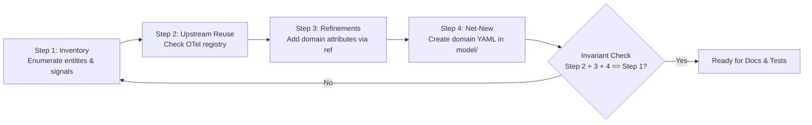

# Contributing to OpenTelemetry Semantic Conventions — Mainframe & Virtualization

Welcome to the OpenTelemetry Mainframe Semantic Conventions repository!

New to OpenTelemetry? Read the
[New Contributor Guide](https://github.com/open-telemetry/community/blob/main/guides/contributor/README.md)
first — it covers the CLA, Code of Conduct, and general community guidelines.

---

## Table of contents

- [1. Quick-start checklist](#1-quick-start-checklist)
- [2. Prerequisites](#2-prerequisites)
- [3. Repository structure](#3-repository-structure)
- [4. Authoring principles](#4-authoring-principles)
  - [4.1 Schema version (definition/2 only)](#41-schema-version-definition2-only)
  - [4.2 Minimal model and federated conventions](#42-minimal-model-and-federated-conventions)
  - [4.3 Signal-type neutrality (metrics, traces, logs, profiles)](#43-signal-type-neutrality-metrics-traces-logs-profiles)
  - [4.4 Namespace extensibility](#44-namespace-extensibility)
- [5. Four-step authoring process](#5-four-step-authoring-process)
  - [5.1 Step 1 — Inventory](#51-step-1--inventory)
  - [5.2 Step 2 — Upstream reuse (use-as-is)](#52-step-2--upstream-reuse-use-as-is)
  - [5.3 Step 3 — Refinements](#53-step-3--refinements)
  - [5.4 Step 4 — Net-new definitions](#54-step-4--net-new-definitions)
  - [5.5 Inventory-to-coverage invariant](#55-inventory-to-coverage-invariant)
- [6. YAML authoring rules (inlined from mf-semvconv-author)](#6-yaml-authoring-rules-inlined-from-mf-semvconv-author)
  - [6.1 Entity definitions](#61-entity-definitions)
  - [6.2 Entity refinements](#62-entity-refinements)
  - [6.3 Metric refinements](#63-metric-refinements)
  - [6.4 Net-new metrics (and spans, logs, profiles)](#64-net-new-metrics-and-spans-logs-profiles)
  - [6.5 Attribute definitions](#65-attribute-definitions)
  - [6.6 File naming conventions](#66-file-naming-conventions)
  - [6.7 Stability lifecycle](#67-stability-lifecycle)
- [7. Making a change (workflow)](#7-making-a-change-workflow)
  - [7.1 Modify the YAML model](#71-modify-the-yaml-model)
  - [7.2 Regenerate docs](#72-regenerate-docs)
  - [7.3 Validate policies](#73-validate-policies)
  - [7.4 Update reference scenarios (simulator)](#74-update-reference-scenarios-simulator)
  - [7.5 Add documentation](#75-add-documentation)
  - [7.6 Update the changelog](#76-update-the-changelog)
- [8. Documentation requirements](#8-documentation-requirements)
- [9. Simulator and test requirements](#9-simulator-and-test-requirements)
  - [9.1 Topology configuration (simulator_config.yaml)](#91-topology-configuration-simulator_configyaml)
  - [9.2 Workload rules (workload_profile.yaml)](#92-workload-rules-workload_profileyaml)
  - [9.3 Running the simulator](#93-running-the-simulator)
  - [9.4 Pytest coverage rules](#94-pytest-coverage-rules)
- [10. Adding a new namespace](#10-adding-a-new-namespace)
- [11. Keep PRs small](#11-keep-prs-small)
- [12. Asking questions](#12-asking-questions)
- [13. Approvers and Maintainers](#13-approvers-and-maintainers)

---

## 1. Quick-start checklist

Before submitting a Pull Request, verify each step:

1. [ ] **Inventory complete:** Step 1 inventory covers all target entities and signals (metrics, spans, logs, profiles).
2. [ ] **Minimal YAML:** Maximized upstream reuse (Step 2) and refinements (Step 3) before adding net-new definitions (Step 4).
3. [ ] **Schema validation:** Every YAML file under `model/` starts with `file_format: definition/2`.
4. [ ] **Docs generated:** Ran `make generate-all` to refresh auto-generated documentation and status reports.
5. [ ] **Policy compliance:** `make check-policies` runs clean with no validation errors or warnings.
6. [ ] **Simulator updated:** Added topology entries in `reference/simulator_config.yaml` and workload rules in `reference/workload_profile.yaml` for every entity emitting telemetry.
7. [ ] **Emission verified:** Ran `cd reference && ./demo.sh emit-once` and confirmed the new signals appear.
8. [ ] **Test coverage:** `cd reference && pytest tests/ -q` passes, including the topology-coverage tests that pair every entity type with a simulator node.
9. [ ] **Documentation updated:** `brief`/`note` fields read well on the generated registry pages, and any definition carrying `annotations.hmc_source` has a matching row in `docs/hmc-api-signal-mapping.md`.
10. [ ] **Changelog fragment:** Added a Towncrier fragment in `changelog.d/`.

---

## 2. Prerequisites

- [Podman](https://podman.io/) or [Docker](https://docs.docker.com/get-docker/) — `make` runs Weaver via the `otel/weaver` container image. The Makefile prefers `podman` and falls back to `docker`; no aliasing is needed. If you keep several Podman machines, make sure the running one is the default connection (`podman system connection default <name>`), or the build will fail to reach the socket.
- [GNU Make](https://www.gnu.org/software/make/) — pre-installed on macOS and Linux. On Windows, use [WSL](https://learn.microsoft.com/windows/wsl/install) or install via [Chocolatey](https://chocolatey.org/) (`choco install make`) or [Scoop](https://scoop.sh/) (`scoop install make`).
- [Python 3.10+](https://www.python.org/) with `pytest` and `pyyaml` for running the reference simulator tests.
- [mise](https://mise.jdx.dev/) (optional) for link and format checks (`mise run links`).

---

## 3. Repository structure

```text
├── .build/                    # Build scratch (not committed)
│   ├── sc-upstream-v*/        # Upstream OTel registry checkout
│   ├── sc-upstream-filtered/  # Upstream v1 group stubs (auto-filtered)
│   └── weaver-policies/       # Upstream Weaver policy bundle
├── changelog.d/               # Towncrier changelog fragments + towncrier.toml
├── diagnostic_templates/      # Weaver diagnostic output templates
├── docs/
│   ├── hmc-api-background.md      # Hand-authored: HMC architecture and collector pipeline
│   ├── hmc-api-signal-mapping.md  # Hand-authored: HMC API -> OTel signal cross-reference
│   └── registry/              # Auto-generated registry pages (make generate-all)
│       ├── mainframe/         # entities, entity-refinements, metrics, metric-refinements
│       ├── virtualization/
│       └── zos/
├── model/
│   ├── manifest.yaml          # Model manifest defining registry metadata
│   ├── mainframe/             # IBM Z / LinuxONE hardware-layer definitions
│   │   ├── attributes_*.yaml  # Attribute definitions by concept
│   │   ├── entities*.yaml     # Entity definitions and refinements
│   │   ├── metrics_*.yaml     # Net-new metric definitions
│   │   └── metrics_refinements_*.yaml # Metric refinements on upstream namespaces
│   ├── virtualization/        # Cross-platform hypervisor, partition, and VM definitions
│   └── zos/                   # IBM z/OS operating-system-layer definitions
├── policies/
│   └── check/                 # Repo-local Rego policies enforced by make check-policies
├── templates/                 # Weaver generation templates
└── reference/                 # Domain-agnostic simulator, config, tests, and scenarios
    ├── demo.sh                # Interactive CLI demo and emitter script
    ├── docker-compose.yaml    # Local OTel collector / Prometheus / Grafana stack
    ├── otel_semconv_sim.py    # Runtime definition/2 simulator engine
    ├── simulator_config.yaml  # Simulator topology and entity configuration
    ├── workload_profile.yaml  # Workload generators and metric simulation rules
    ├── scenarios/             # Narrative walkthroughs per namespace
    └── tests/
        └── test_simulator.py  # Pytest suite asserting model and signal coverage
```

---

## 4. Authoring principles

### 4.1 Schema version (definition/2 only)

All local model files MUST specify:

```yaml
file_format: definition/2
```

Files without this header are silently ignored by the reference simulator and Weaver. **Never use the legacy v1 `groups:` schema in local model files.** Upstream conventions (`system.*`, `hw.*`, `container.*`, `host`, etc.) are imported as filtered stubs into `.build/sc-upstream-filtered/` during the build process and are never duplicated in the local model.

### 4.2 Minimal model and federated conventions

The goal of federated semantic conventions is to express the maximum domain observability with the minimum amount of local YAML. Model authoring follows a strict precedence hierarchy:

$$\text{Upstream Reuse (as-is)} \succ \text{Refinement} \succ \text{Net-New}$$

1. **Upstream Reuse:** If an upstream OTel concept represents the domain element without change, reuse it directly.
2. **Refinement:** If an upstream concept represents the domain element but needs domain-specific attributes or associations, define an `entity_refinement` or `metric_refinement` (or span/log/profile refinement).
3. **Net-New:** If and only if no upstream concept fits, create a net-new definition under `model/<namespace>/`.

### 4.3 Signal-type neutrality (metrics, traces, logs, profiles)

Conventions apply equally to all OpenTelemetry signal types:

- **Metrics:** Numeric time-series measurements (gauges, counters, histograms).
- **Spans / Traces:** Units of work representing execution context and operations.
- **Log Events:** Structured events with discrete semantic payloads.
- **Profiles:** Stack trace and continuous profiling data samples.

The authoring rules and four-step process described below apply uniformly across all four signals.

### 4.4 Namespace extensibility

Every rule is designed to scale across namespaces:

- `mainframe`: Hardware and firmware layer for IBM Z and LinuxONE (CPC, channels, adapters, physical processors).
- `virtualization`: Cross-platform hypervisor, logical partition (LPAR), virtual machine, resource pool, and virtual switch layer.
- `zos`: IBM z/OS operating system, address spaces, subsystems, and workload management.
- `<namespace>`: Any new platform or domain namespace (e.g., `tps`, `storage`, `cics`).

All attribute names MUST be namespaced with lowercase dot-separated notation: `<namespace>.<concept>.<property>` (e.g., `mainframe.cpu.type`, `virtualization.partition.name`, `zos.address_space.job_name`).

---

## 5. Four-step authoring process



### 5.1 Step 1 — Inventory

Enumerate every domain entity and every piece of telemetry (metrics, spans, log events, profile samples) to be supported. Produce a structured inventory table:

| Entity Name | Telemetry Name | Signal Type | Brief Description |
| :--- | :--- | :--- | :--- |
| `mainframe.cpu` | `mainframe.cpu.utilization` | Metric | Processor busy ratio (0–1) |
| `mainframe.host` | `system.cpu.utilization` | Metric | Host CPU utilization by mode |
| `zos.job` | `zos.job.execution` | Span | Unit of batch job execution |
| `zos.syslog` | `zos.syslog.message` | Log Event | System operator message |
| `zos.task` | `zos.task.cpu_samples` | Profile | Execution sample stack traces |

### 5.2 Step 2 — Upstream reuse (use-as-is)

Compare each inventory item against the upstream OpenTelemetry registry. If an upstream entity, metric, span, log event, or profile sample accurately models the concept without changes:

- **Action:** Document it as a direct upstream reference.
- **YAML impact:** No new YAML file needed.
- **Example:** Reusing the upstream `host` entity or standard HTTP span conventions for management endpoints.

### 5.3 Step 3 — Refinements

For inventory items substantially identical to an upstream concept but requiring additional domain attributes or specific notes:

- **Action:** Create an `entity_refinement`, `metric_refinement`, or span/log/profile refinement using `ref: <upstream-name>`.
- **Inheritance rule:** Metric refinements inherit instrument type and unit from upstream. **Never** redeclare `instrument` or `unit` on a `metric_refinement`.
- **Metric Example:** Refining `system.cpu.utilization` with `mainframe.cpu.type` and `mainframe.cpu.sharing.mode`.
- **Non-Metric (Span/Log) Example:** Refining an upstream RPC/database span convention by referencing the upstream span name and attaching platform-specific connection attributes or entity associations.

### 5.4 Step 4 — Net-new definitions

For domain-specific concepts with no upstream equivalent, author net-new definitions under `model/<namespace>/`:

- Attributes: `attributes_<concept>.yaml`
- Entities: `entities.yaml` or `entities_<concept>.yaml`
- Metrics: `metrics_<concept>.yaml`
- Spans: `spans_<concept>.yaml`
- Log Events: `events_<concept>.yaml`
- Profiles: `profiles_<concept>.yaml`

### 5.5 Inventory-to-coverage invariant

$$\sum (\text{Step 2 Upstream Reuse}) + \sum (\text{Step 3 Refinements}) + \sum (\text{Step 4 Net-New}) = \text{Step 1 Inventory}$$

**Strict Rule:** No inventory item may be left unresolved. Every entity type that carries a signal must also appear in the simulator topology — `reference/tests/test_simulator.py` enforces this in both directions, so a new entity type without a topology node fails the suite.

---

## 6. YAML authoring rules (inlined from mf-semvconv-author)

### 6.1 Entity definitions

Every entity definition MUST include: `type`, `brief`, `stability`, `requirement_level`, `identity[]`, and `description[]`. Every attribute referenced in `description[]` MUST specify an explicit `requirement_level`.

```yaml
file_format: definition/2
entities:
  - type: mainframe.channel
    brief: >
      A mainframe I/O channel, representing a physical channel path connecting
      the CPC to peripheral devices.
    stability: development
    requirement_level: recommended
    identity:
      - ref: mainframe.channel.name
    description:
      - ref: mainframe.channel.mode
        requirement_level: required
      - ref: mainframe.channel.owning.partition
        requirement_level: recommended
```

### 6.2 Entity refinements

Entity refinements extend upstream entities with domain-specific attributes. Refinements MUST include: `id` (pattern: `refinement.<namespace>.<concept>[.<base>]`), `ref` (upstream entity name), `brief`, `stability`, and `description[]`.

```yaml
file_format: definition/2
entity_refinements:
  - id: refinement.mainframe.host
    ref: host
    brief: >
      Mainframe refinement of the generic host entity for the IBM Z Central
      Processing Complex (CPC).
    stability: development
    identity:
      - ref: host.name
        note: The name of the CPC configured on the HMC.
    description:
      - ref: host.id
        requirement_level: recommended
      - ref: mainframe.host.serial_number
        requirement_level: recommended
```

### 6.3 Metric refinements

Metric refinements add domain attributes and entity associations to upstream metrics. Refinements MUST include: `id` (pattern: `refinement.<namespace>.<upstream.metric.name>`), `ref` (upstream metric name), `brief`, `stability`, `entity_associations[]`, and `attributes[]`.

> **CRITICAL:** Do NOT include `instrument` or `unit` in a `metric_refinement` — they are inherited from upstream.

```yaml
file_format: definition/2
metric_refinements:
  - id: refinement.mainframe.system.cpu.utilization
    ref: system.cpu.utilization
    brief: "Per-logical-CPU utilization by mode, extended for IBM Z processor specialization."
    stability: development
    entity_associations:
      - virtualization.platform
      - virtualization.partition
    attributes:
      - ref: mainframe.cpu.type
        requirement_level: required
        note: IBM Z processor specialization type (cp, ifl, ziip, icf, sap, cbp, aap).
      - ref: mainframe.cpu.sharing.mode
        requirement_level: opt_in
```

### 6.4 Net-new metrics (and spans, logs, profiles)

#### Net-New Metric Conventions
MUST specify: `name`, `instrument`, `unit`, `brief`, `stability`, and `entity_associations[]`.

```yaml
file_format: definition/2
metrics:
  - name: mainframe.cpu.utilization
    brief: "The fraction of time the mainframe physical processor was busy executing work (0 to 1)."
    instrument: gauge
    unit: "1"
    stability: development
    requirement_level: recommended
    entity_associations:
      - mainframe.cpu
    attributes:
      - ref: mainframe.cpu.name
        requirement_level: required
```

#### Net-New Span Conventions
MUST specify: `span_name` (or operation pattern), `span_kind`, `brief`, `stability`, and `entity_associations[]`.

```yaml
file_format: definition/2
spans:
  - span_name: zos.job.execute
    span_kind: internal
    brief: "Execution span for a z/OS batch job step."
    stability: development
    entity_associations:
      - zos.address_space
    attributes:
      - ref: zos.job.name
        requirement_level: required
```

#### Net-New Log Event Conventions
MUST specify: `event_name`, `brief`, `stability`, and `entity_associations[]`.

```yaml
file_format: definition/2
events:
  - event_name: zos.operator.message
    brief: "A write-to-operator (WTO) message emitted on the z/OS system console."
    stability: development
    entity_associations:
      - zos.system
    attributes:
      - ref: zos.message.id
        requirement_level: required
```

#### Net-New Profile Conventions
MUST specify: `profile_type`, `brief`, `stability`, and `entity_associations[]`.

```yaml
file_format: definition/2
profiles:
  - profile_type: cpu.samples
    brief: "CPU execution sample stack traces collected from z/OS address spaces."
    stability: development
    entity_associations:
      - zos.address_space
    attributes:
      - ref: zos.job.name
        requirement_level: required
```

### 6.5 Attribute definitions

Attributes are declared in `attributes_<concept>.yaml` files under `model/<namespace>/`. Every attribute MUST include: `key`, `type` (primitive or enum with `members`), `brief`, and `stability`.

```yaml
file_format: definition/2
attributes:
  - key: mainframe.cpu.type
    stability: development
    brief: "The type of mainframe processor within the Central Processing Complex (CPC)."
    type:
      members:
        - id: cp
          value: "cp"
          brief: "Central Processor (CP), general-purpose processor hosting an OS such as z/OS."
          stability: development
        - id: ifl
          value: "ifl"
          brief: "Integrated Facility for Linux (IFL), dedicated to Linux workloads."
          stability: development
```

### 6.6 File naming conventions

| File Pattern | Content | Example |
| :--- | :--- | :--- |
| `attributes_<concept>.yaml` | Attribute definitions | `model/mainframe/attributes_cpu.yaml` |
| `entities.yaml` or `entities_<concept>.yaml` | Entity definitions & refinements | `model/mainframe/entities.yaml` |
| `metrics_<concept>.yaml` | Net-new metric definitions | `model/mainframe/metrics_cpu.yaml` |
| `metrics_refinements_<base>.yaml` | Metric refinements of upstream base | `model/mainframe/metrics_refinements_system.yaml` |
| `spans_<concept>.yaml` | Span conventions | `model/zos/spans_job.yaml` |
| `events_<concept>.yaml` | Log event conventions | `model/zos/events_syslog.yaml` |
| `profiles_<concept>.yaml` | Profile conventions | `model/zos/profiles_cpu.yaml` |

### 6.7 Stability lifecycle

Stability levels progress strictly in one direction:

$$\text{development} \longrightarrow \text{release\_candidate} \longrightarrow \text{stable}$$

- **Rules:**
  - All new definitions start at `development`. Every definition in this
    repository is currently at `development`.
  - `release_candidate` is the optional staging step upstream uses before
    declaring a convention `stable`; promoting straight from `development` to
    `stable` is allowed but should be a deliberate, reviewed decision.
  - Never downgrade stability (e.g., `stable` back to `development`).
  - The legacy `experimental` and `alpha` values still appear in a handful of
    upstream definitions. Do not use them in new local definitions.

---

## 7. Making a change (workflow)

### 7.1 Modify the YAML model
Create or update the YAML files under `model/<namespace>/` following the `definition/2` schema and the rules in Section 6.

### 7.2 Regenerate docs
Run Weaver code and documentation generators:

```bash
make generate-all
```

This regenerates registry docs in `docs/registry/`, updates status reports, and injects generated attribute/metric tables into hand-written doc pages.

### 7.3 Validate policies
Validate the model against OpenTelemetry semantic convention policies:

```bash
make check-policies
```

Optional: Run documentation link validation:

```bash
mise run links
```

### 7.4 Update reference scenarios (simulator)
1. Configure new entities in `reference/simulator_config.yaml`.
2. Configure workload generators in `reference/workload_profile.yaml`.
3. Emit one telemetry cycle and inspect the output:
   ```bash
   cd reference && ./demo.sh emit-once
   # or, directly:
   cd reference && python otel_semconv_sim.py --once
   ```
   Useful flags: `--config` (alternate config), `--namespaces` (override the
   namespace include filter), `--interval` (override the sampling interval).
4. Run pytest test suite:
   ```bash
   pytest reference/tests/test_simulator.py
   ```

### 7.5 Add documentation
Registry pages regenerate themselves; update the hand-authored pages under `docs/` where the change needs narrative or an HMC source mapping (see [Section 8](#8-documentation-requirements)).

### 7.6 Update the changelog
Add a Towncrier fragment under `changelog.d/`:

- Filename pattern: `<pr-number>.<type>.md` (or `+.<type>.md` before PR creation).
- Supported types (see `changelog.d/towncrier.toml`): `breaking`, `deprecation`, `component`, `enhancement`, `bugfix`, `clarification`.

---

## 8. Documentation requirements

Documentation in this repository comes in two forms.

**Auto-generated registry pages** under `docs/registry/<namespace>/` are produced
by `make generate-all` and MUST NOT be hand-edited. Weaver emits one page per
definition kind that the namespace uses — `entities.md`, `entity-refinements.md`,
`metrics.md`, `metric-refinements.md` — plus a `README.md` attribute registry.
Write the `brief` and `note` fields in the model well: they are the text that
ends up on these pages.

**Hand-authored pages** under `docs/` carry the narrative that cannot be derived
from the model:

- `docs/hmc-api-background.md` — platform architecture, entity construction, and
  collector pipeline details.
- `docs/hmc-api-signal-mapping.md` — the IBM Z HMC Web Services API cross-reference.
  It maps only those signals that have an HMC API source, and each row must agree
  with the `annotations.hmc_source` block on the corresponding definition. The
  model may contain definitions with no HMC source; those do not appear here.

When adding a definition, make sure its `brief`/`note` render usefully, and if it
carries an `annotations.hmc_source`, add the matching row to the signal-mapping
document in the same PR.

## 9. Simulator and test requirements

The reference simulator (`reference/otel_semconv_sim.py`) is domain-agnostic and
ingests `model/` at runtime. The namespaces it loads are listed in
`spec.registry.paths` in `reference/simulator_config.yaml`.

### 9.1 Topology configuration (simulator_config.yaml)

For every entity type that carries a signal, declare at least one node. The
topology is a **tree**: nodes nest under `children`, and a child inherits the
resource context of its parent. `identity` holds the entity's identifying
attributes; `attributes` holds descriptive ones.

```yaml
spec:
  topology:
    entities:
      - type: virtualization.platform
        identity:
          host.name: "CPC01"
        attributes:
          virtualization.system.name: "ibm.prsm"
        children:
          - type: mainframe.channel
            identity:
              mainframe.channel.name: "0.1A"
            attributes:
              mainframe.channel.mode: "shared"
```

### 9.2 Workload rules (workload_profile.yaml)

Rules live under `spec.rules[]`. Each rule selects metrics either by name
(`match.pattern`, a regular expression) or by shape (`match.type` plus optional
`match.unit`), and names a generator function with its parameters. Available
functions: `gaussian`, `diurnal`, `counter_accumulator`, `pareto_spikes`.

```yaml
spec:
  rules:
    - match:
        pattern: "^mainframe\\.host\\.humidity$"
      generator:
        function: gaussian
        params: {mean: 0.45, stddev: 0.03, clamp_min: 0.3, clamp_max: 0.65}
    # Shape-based fallback: any gauge measured as a ratio
    - match: {type: gauge, unit: "1"}
      generator:
        function: diurnal
        params: {min: 0.05, max: 0.95, base: 0.52, amplitude: 0.32, period: 86400.0}
```

Prefer a name rule over the shape fallback whenever a metric is not a plain
ratio or rate — a discrete status code driven by the generic ratio generator
produces meaningless sample data.

### 9.3 Running the simulator

```bash
cd reference
./demo.sh emit-once          # one cycle to stdout
./demo.sh emit-continuous    # continuous emission
./demo.sh start | stop       # local collector/Prometheus/Grafana stack
```

No sample output artifacts are committed; the simulator is run on demand and
the pytest suite asserts against a live emission cycle.

### 9.4 Pytest coverage rules

The suite in `reference/tests/test_simulator.py` enforces:

1. **Registry loading:** the local model parses and every metric declares an
   instrument and a unit.
2. **Entity/metric coverage:** every entity type has at least one associated
   metric, with explicit allowlists for entities whose metrics resolve only from
   upstream refinements.
3. **Topology coverage, both directions:** every topology entity type exists in
   the registry, and every entity type carrying a metric has a topology node
   (allowlisted exceptions must be declared in the test).
4. **Emission:** each entity with metrics emits at least one data point, all
   values are numeric and non-NaN, and emitted data points carry the attributes
   the model declares.

Run it with:

```bash
cd reference && pytest tests/ -q
```

## 10. Adding a new namespace

To add a new namespace (e.g., `zos`, `tps`, or `storage`), execute the following self-contained steps:

1. **Step 1 — Build Inventory:** Create an inventory table enumerating all target entities and signals (metrics, spans, logs, profiles).
2. **Step 2 — Evaluate Upstream:** Check the OpenTelemetry registry for reusable entities, metrics, spans, logs, or profiles.
3. **Step 3 — Create Directory:** Create `model/<namespace>/`.
4. **Step 4 — Author Definitions:**
   - Create `model/<namespace>/attributes_<concept>.yaml` for attributes (`file_format: definition/2`).
   - Create `model/<namespace>/entities.yaml` for entity definitions and refinements.
   - Create `model/<namespace>/metrics_<concept>.yaml` for net-new metrics, or `metrics_refinements_<base>.yaml` for upstream refinements.
   - For spans, logs, or profiles, add `spans_<concept>.yaml`, `events_<concept>.yaml`, or `profiles_<concept>.yaml`.
5. **Step 5 — Generate & Validate:**
   ```bash
   make generate-all
   make check-policies
   ```
6. **Step 6 — Configure Simulator:**
   - Add nodes to `reference/simulator_config.yaml` under `spec.topology.entities[]`.
   - Add workload rules to `reference/workload_profile.yaml`.
   - Run `./demo.sh emit-once` and confirm the new entities emit.
7. **Step 7 — Write Tests:** Add test cases in `reference/tests/test_simulator.py` asserting entity presence, signal generation, and attribute validity.
8. **Step 8 — Author Docs:** Regenerate the registry pages, and add narrative or source-mapping rows to the hand-authored pages under `docs/` where needed.
9. **Step 9 — Changelog:** Create `changelog.d/+.<type>.md`.

---

## 11. Keep PRs small

Small, focused PRs are much easier to review and land quickly:

- Consider phasing larger changes across multiple PRs (e.g., PR 1: Attributes & Entities, PR 2: Metrics & Refinements, PR 3: Simulator & Docs).
- If a review surfaces contentious design questions, split uncontroversial parts into separate PRs so progress is not blocked.

---

## 12. Asking questions

- **CNCF Slack:** Post in [#otel-mainframes](https://cloud-native.slack.com/archives/C05PXDFTCPJ) on [CNCF Slack](https://slack.cncf.io/).
- **Mainframe SIG:** Join the bi-weekly [Mainframe SIG Meeting](https://github.com/open-telemetry/community#sig-mainframes) and add your topic to the [meeting agenda](https://docs.google.com/document/d/14p-bpofozTL4n3jy6HZH_TKjoOXvog18G1HBRqq6liE/edit).

---

## 13. Approvers and Maintainers

### Maintainers

- [Antoine Toulme](https://github.com/atoulme), Splunk
- [Greg Shriver](https://github.com/gshriver), Broadcom
- [Ruediger Schulze](https://github.com/rrschulze), IBM

For more information about the maintainer role, see the [Community Membership Guide](https://github.com/open-telemetry/community/blob/main/guides/contributor/membership.md#maintainer).

### Approvers

- [Antoine Toulme](https://github.com/atoulme), Splunk
- [Greg Shriver](https://github.com/gshriver), Broadcom
- [Ruediger Schulze](https://github.com/rrschulze), IBM

For more information about the approver role, see the [Community Membership Guide](https://github.com/open-telemetry/community/blob/main/guides/contributor/membership.md#approver).

Approvers assign themselves to non-editorial PRs to drive reviews through to merge. Over a rolling 3-month window, an approver is expected to drive the review of at least 3 non-editorial PRs.
